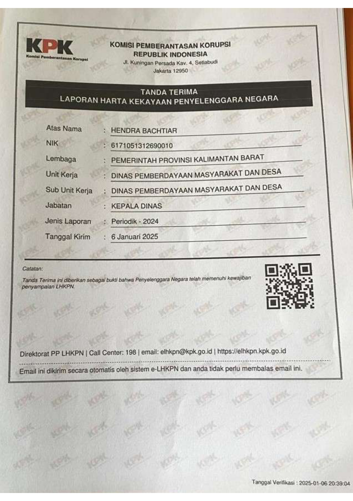

  

    
Profil Pejabat

    Dinas Pemberdayaan Masyarakat & Desa
  

  <!-- PROFIL PIMPINAN -->
  

    

    
  

  <!-- LHKPN -->
  

  <h2>LHKPN Pimpinan</h2>

  

    

      

        

        
      

      

        Tahun 2023
      

    

    

      

        

        
      

      

        Tahun 2024
      

    

    

      

        

        
      

      

        Tahun 2025
      

    

    

  

  <!-- DOKUMEN -->
  

  <h2>Dokumen LHKPN & LHKASN</h2>

  

    <a class="link-btn" href="https://datacloud.kalbarprov.go.id/index.php/s/yqgbGJNmrGLcxKC" target="_blank">
      

        
📄

        LHKPN dan LHKASN
      

      
➜

    </a>

    <a class="link-btn" href="https://drive.google.com/drive/folders/1utSegR0Jrw7gvP0Eviffh4i1ewdPFTf8" target="_blank">
      

        
📄

        LHKPN Tahun 2024
      

      
➜

    </a>

    <a class="link-btn" href="https://drive.google.com/file/d/1_CkrYjwVpA4uEBYM29Hnabp5CFKNLCCA/view" target="_blank">
      

        
📄

        Rekap LHKPN
      

      
➜

    </a>

    <a class="link-btn" href="https://drive.google.com/file/d/1Jn7AhOsOJvPK6GpJAdDLQQKmRtieBvbF/view" target="_blank">
      

        
📄

        LHKPN & LHKASN 2025
      

      
➜

    </a>

    <a class="link-btn" href="https://drive.google.com/file/d/1t6cmlA11QeXTdGTuoCs2lFMvqwZiJGub/view" target="_blank">
      

        
📄

        Rekap LHKPN 2025
      

      
➜

    </a>
  

  

