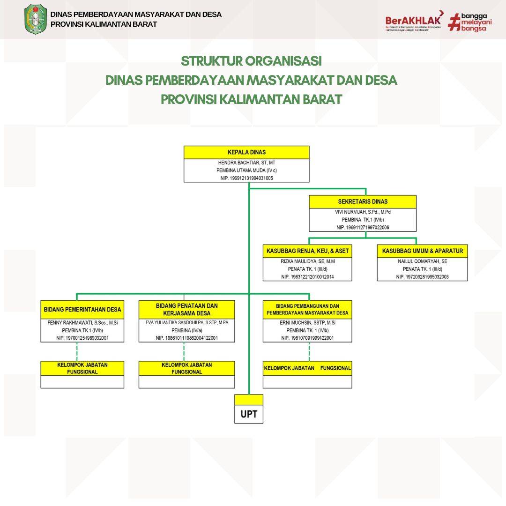

  

    
Profil Badan

    Dinas Pemberdayaan Masyarakat & Desa
  

  <!-- ===== SEJARAH ===== -->

  <h2>Sejarah</h2>

  

    Pada Januari 2013, resmi terbentuk Badan Pemberdayaan Masyarakat dan Pemerintahan Daerah (BPMPD) Provinsi Kalimantan Barat. Drs. Y. Alexander, M.Si kemudian diamanahkan untuk memimpin lembaga baru ini.
  

  

    Perjalanan kelembagaan ini memiliki akar sejarah panjang sejak Konferensi Gubernur tahun 1954, mulai dari Kementerian Pembangunan Masyarakat Desa, Ditjen Bangdes, hingga Ditjen Pemberdayaan Masyarakat dan Desa. Perubahan-perubahan ini dilakukan untuk memperkuat peran pemerintah dalam meningkatkan kualitas pembangunan dan pemberdayaan desa.
  

  

    Fungsi lembaga mencakup dua aspek utama: pemberdayaan masyarakat desa—meliputi partisipasi, kelembagaan, perencanaan, administrasi, dan ketertiban—serta fungsi koordinatif lintas sektor seperti pendidikan, kesehatan, pertanian, dan infrastruktur desa.
  

  

    Lembaga ini juga memegang peran penting dalam pelaksanaan berbagai program nasional seperti PNPM-MPd, Lomba Desa, Bulan Bhakti Gotong Royong, TMMD, UED-SP, BUMDes, Posyandu, dan kegiatan strategis lainnya.
  

  

    Pada tahun 2016, berdasarkan Peraturan Daerah Provinsi Kalimantan Barat Nomor 8 Tahun 2016 dan Peraturan Gubernur Nomor 107 Tahun 2016, BPMPD resmi berubah menjadi 
    <strong>Dinas Pemberdayaan Masyarakat dan Desa (Dinas PMD)</strong>.
  

  
 
    <!-- ===== Visi Misi ===== -->
    
  

    Visi
    
“Terwujudnya Kesejahteraan Masyarakat Kalimantan Barat melalui Percepatan Pembangunan Infrastruktur dan Perbaikan Tata Kelola Pemerintahan”

  

  

    <h2>Misi</h2>
    <ul class="custom-list">
      <li>Mewujudkan percepatan pembangunan infrastruktur.</li>
      <li>Mewujudkan tata kelola pemerintahan berkualitas dengan prinsip Good Governance.</li>
      <li>Mewujudkan kualitas hidup masyarakat.</li>
      <li>Mewujudkan masyarakat sejahtera.</li>
      <li>Mewujudkan masyarakat yang tertib.</li>
      <li>Mewujudkan pembangunan berwawasan lingkungan.</li>
    </ul>
  

    <!-- ===== Tupoksi ===== -->
    

<h2>Tugas Pokok & Fungsi</h2>

  

    

      <strong>Dasar Hukum:</strong> Peraturan Gubernur Kalimantan Barat Nomor 122 Tahun 2021 tentang Kedudukan, Susunan Organisasi, Tugas dan Fungsi.
    

  

Dinas Pemberdayaan Masyarakat dan Desa Provinsi Kalimantan Barat mempunyai tugas membantu Gubernur melaksanakan urusan pemerintahan yang menjadi kewenangan daerah di bidang pemberdayaan masyarakat dan desa.

<h3 style="color:#0d6e4f; margin-top:30px; font-size:1.3rem;">Fungsi Dinas</h3>
    
    <ul class="custom-list grid-list">
      <li>Perumusan program kerja bidang pemberdayaan masyarakat & desa.</li>
      <li>Perumusan kebijakan pemerintahan desa & kerjasama desa.</li>
      <li>Pelaksanaan kebijakan pemerintahan & pemberdayaan desa.</li>
      <li>Penyelenggaraan urusan pemerintahan bidang desa.</li>
      <li>Koordinasi dan pembinaan teknis pemerintahan desa.</li>
      <li>Pelaksanaan evaluasi dan pelaporan bidang desa.</li>
      <li>Pelaksanaan reformasi birokrasi, SAKIP, dan pelayanan publik.</li>
      <li>Pelaksanaan administrasi di lingkungan Dinas.</li>
      <li>Pelaksanaan tugas lain yang diberikan oleh Gubernur.</li>
    </ul>

<!-- ===== STRUKTUR ORGANISASI ===== -->

  <h2>Struktur Organisasi</h2>

  

  

  
  

  
    

