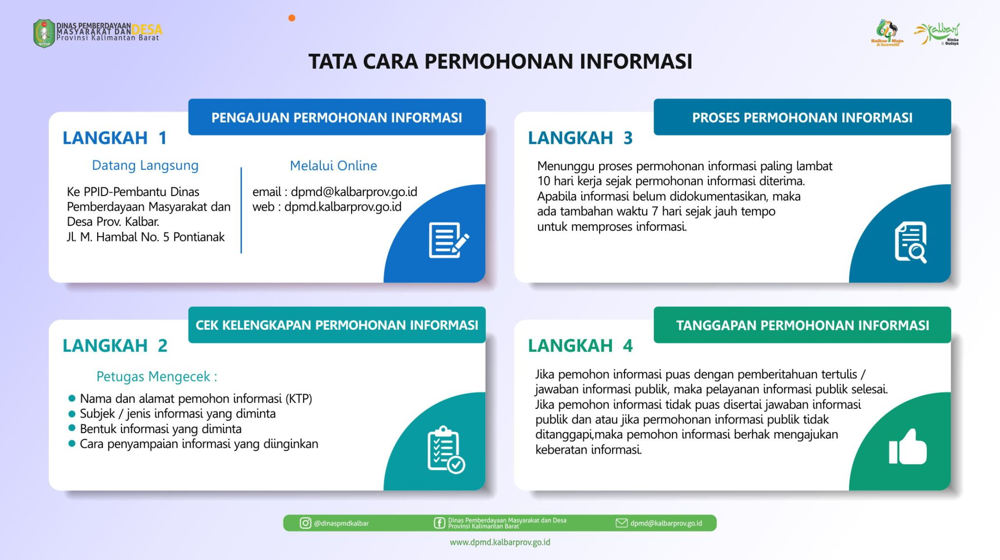
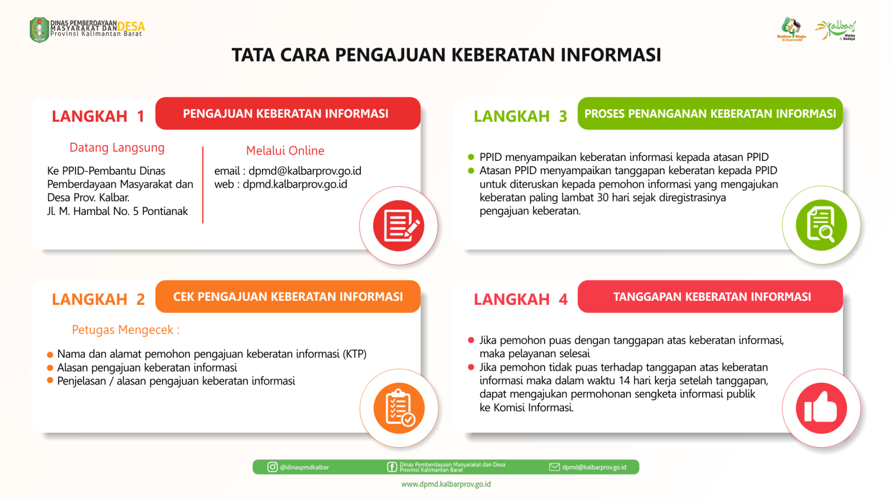
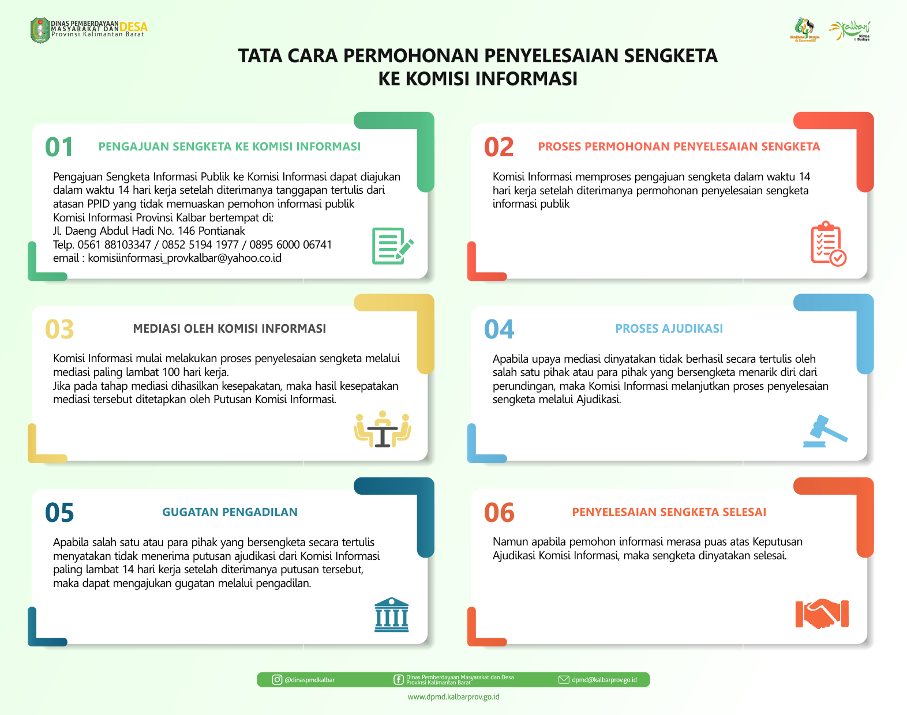
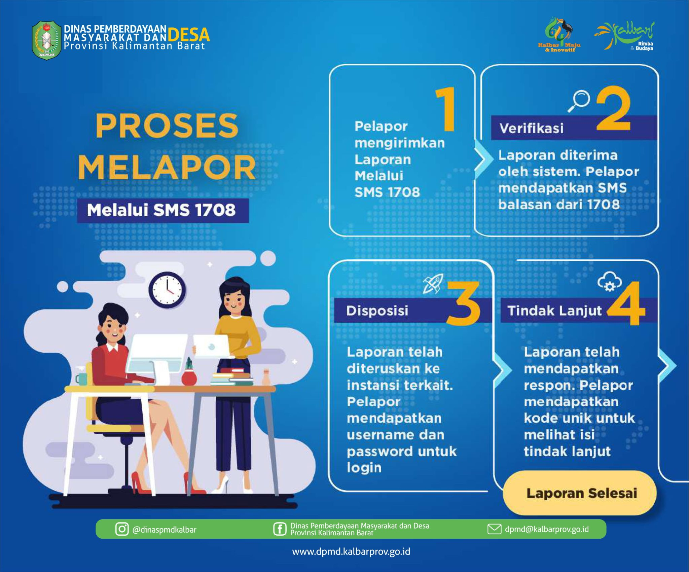

  <!-- HEADER -->
  

    
Tata Cara

    Dinas Pemberdayaan Masyarakat & Desa
  

  <!-- CARD 1 -->
  

    <h2>Tata Cara Permohonan Informasi</h2>
    

      

      
    

  

  <!-- CARD 2 -->
  

    <h2>Tata Cara Memperoleh Informasi Publik</h2>
    

      

      
    

  

  <!-- CARD 3 -->
  

    <h2>Tata Cara Pengajuan Keberatan Informasi</h2>
    

      

      
    

  

  <!-- CARD 4 -->
  

    <h2>Tata Cara Permohonan Penyelesaian Sengketa</h2>
    

      

      
    

  

  <!-- CARD 5 -->
  

    <h2>SOP Pengaduan Penyalahgunaan Wewenang</h2>
    

      

      
    

  

