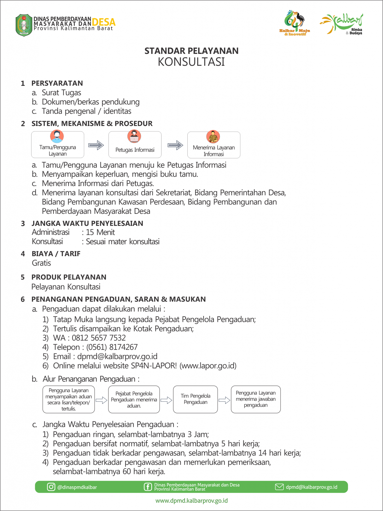
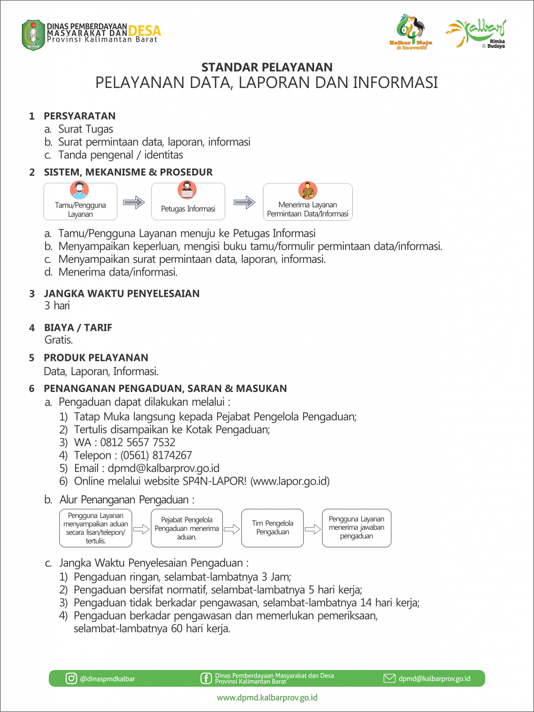
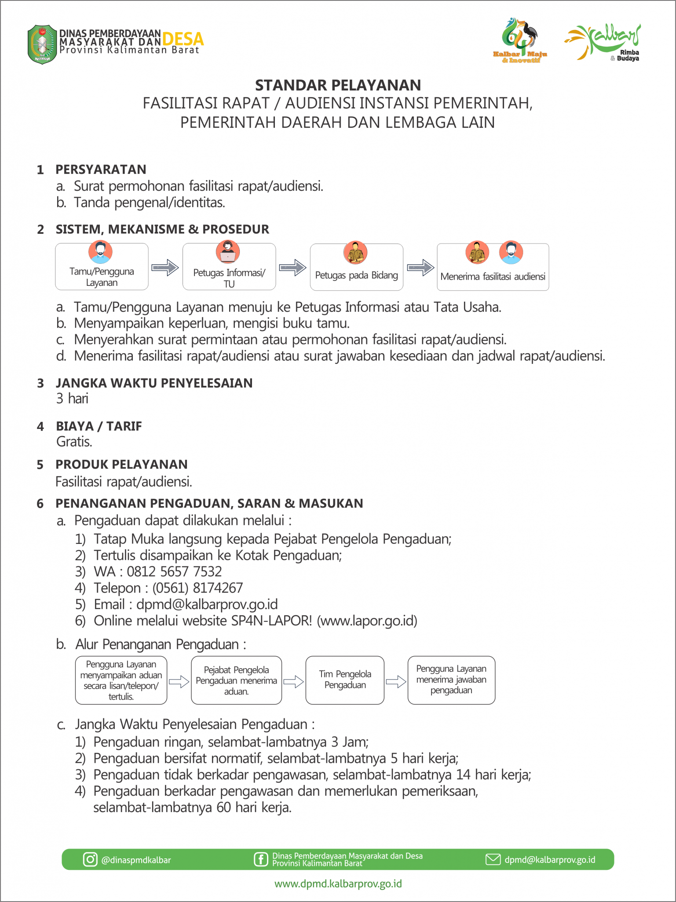
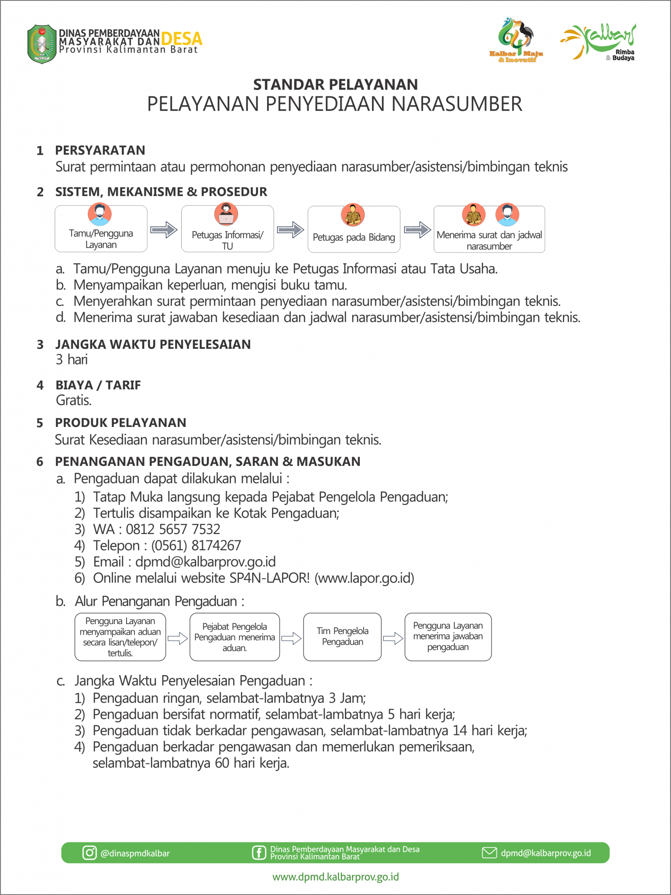

  <!-- ===== HEADER ===== -->
  

    
Standar Pelayanan

    Dinas Pemberdayaan Masyarakat & Desa
  

  <!-- ===== PENJELASAN UMUM ===== -->
  

    <h2>Standar Pelayanan Publik</h2>
    

      Sebagaimana Keputusan Kepala Dinas Pemberdayaan Masyarakat dan Desa Provinsi
      Kalimantan Barat Nomor : 007/PEMDES/2023 tentang Penetapan Standar Pelayanan
      Publik pada Dinas Pemberdayaan Masyarakat dan Desa Provinsi Kalimantan Barat.
    

  

  <!-- ===== SP KONSULTASI ===== -->
  

    
    ## 1. Standar Pelayanan Konsultasi
    
    
  

  <!-- ===== SP DATA ===== -->
  

    
    ## 2. Standar Pelayanan (Pelayanan Data, Laporan dan Informasi)
    
    
  

  <!-- ===== SP RAPAT ===== -->
  

    
    ## 3. Standar Pelayanan (Fasilitasi Rapat / Audiensi)
    
    
  

  <!-- ===== SP NARASUMBER ===== -->
  

    
    ## 4. Standar Pelayanan (Penyediaan Narasumber)
    
    
  

