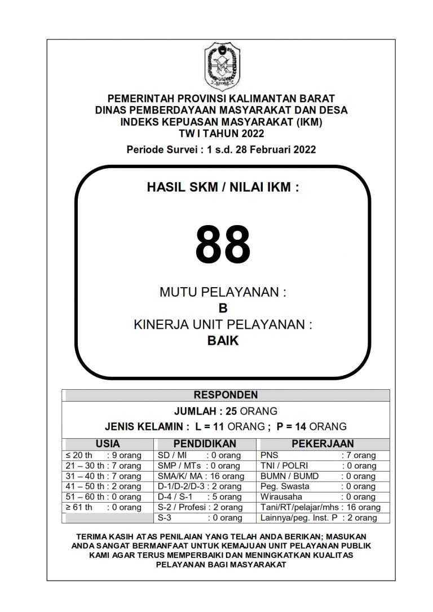
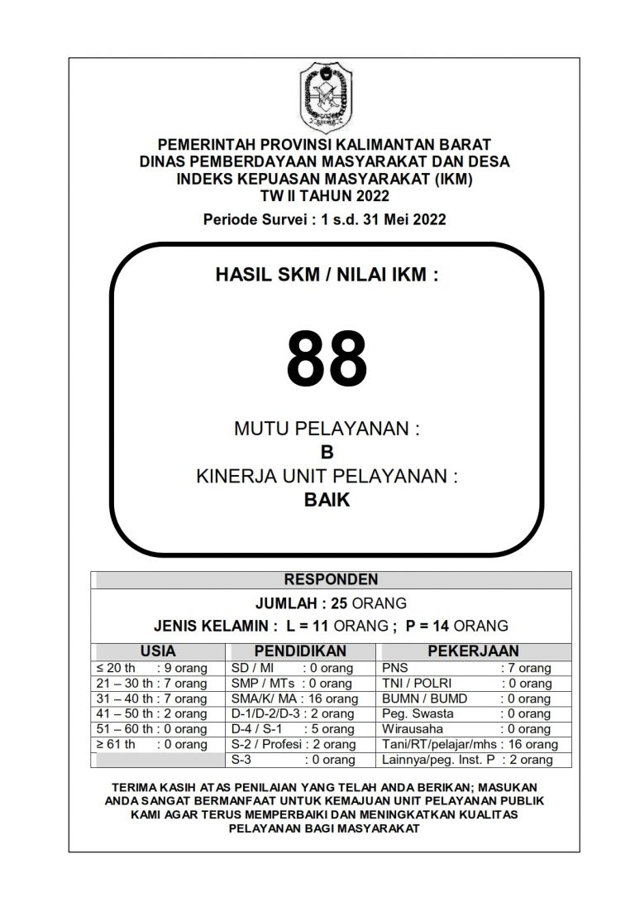

  <!-- HEADER -->
  

    
Survey Kepuasan Masyarakat

    Dinas Pemberdayaan Masyarakat & Desa
  

  <!-- LAPORAN SKM -->
  

    <h2>Laporan SKM</h2>

    

      <a class="link-btn" href="https://drive.google.com/file/d/1F6TpjGDN8sl7dAt6C3QlQQgXZNavG2gQ/view" target="_blank">
        

          
📄

          Laporan SKM TW I • 2022
        

        
➜

      </a>

      <a class="link-btn" href="https://drive.google.com/file/d/161_FDkapGb4O0rb5gGYIjI1u_otoIKKc/view" target="_blank">
        

          
📄

          Laporan SKM TW II • 2022
        

        
➜

      </a>

      <a class="link-btn" href="https://drive.google.com/file/d/1X1s5IcLPNwpDlZSfOU1WMDFs3x8dRb1z/view" target="_blank">
        

          
📄

          Laporan SKM TW III • 2021
        

        
➜

      </a>

      <a class="link-btn" href="https://drive.google.com/file/d/1VJRtsP2MuvDZRvy3i7LOgo8nwfzN5FMq/view" target="_blank">
        

          
📄

          Laporan SKM TW IV • 2021
        

        
➜

      </a>

      <a class="link-btn" href="https://drive.google.com/file/d/1sx0CyCkRHCRFv_f7SazH9bYSGShJWGPQ/view" target="_blank">
        

          
📄

          Laporan SKM • 2024
        

        
➜

      </a>

    

  

  <!-- PUBLIKASI SKM -->
  

    <h2>Publikasi SKM</h2>

    

      

        

        
      

      

        

        
      

      

        

        
      

    

  

  <!-- RENCANA TINDAK LANJUT -->
  

    <h2>Rencana Tindak Lanjut</h2>

    

      <a class="link-btn" href="#" target="">
        

          
📄

          Test
        

        
➜

      </a>

      <a class="link-btn" href="#" target="">
        

          
📄

          Test
        

        
➜

      </a>

    

  

